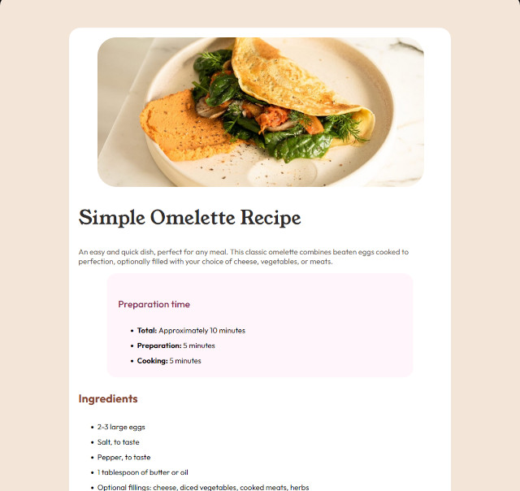

# Frontend Mentor - Recipe page solution

This is a solution to the [Recipe page challenge on Frontend Mentor](https://www.frontendmentor.io/challenges/recipe-page-KiTsR8QQKm). Frontend Mentor challenges help you improve your coding skills by building realistic projects.

## Table of contents

- [Frontend Mentor - Recipe page solution](#frontend-mentor---recipe-page-solution)
  - [Table of contents](#table-of-contents)
  - [Overview](#overview)
    - [Screenshot](#screenshot)
    - [Links](#links)
  - [My process](#my-process)
    - [Built with](#built-with)
    - [What I learned](#what-i-learned)
    - [Continued development](#continued-development)
    - [Useful resources](#useful-resources)
  - [Author](#author)

## Overview

### Screenshot

### Links

- Solution URL: [Recipe Page Solution (Github)](https://flyboy85749.github.io/recipe-page/)
- Live Site URL: [Recipe Page Solution Live](https://javascriptprogrammer.net/recipe_page/)

## My process

- I began with the basic html layout, based on the information given, and then added the css to make it match as closely as possible to the style guide.

### Built with

- Semantic HTML5 markup
- CSS
- Flexbox
- CSS Grid
- Mobile-first workflow

### What I learned

- This was good practice on the use of ordered and unordered lists, and how to style them to match the design, as well as how to scale images based on device screen sizes.
-

### Continued development

I am always learning, and will continue to improve my skills by implementing the latest and greatest techniques that I know of.

### Useful resources

- [Css Tricks](https://css-tricks.com/) - I love this site and the excellent information that can be found here.
- [MDN web docs](https://developer.mozilla.org/en-US/docs/Web/CSS/CSS_flexible_box_layout/Basic_concepts_of_flexbox) - Always a good place to start for any layout and design issues.

## Author

- Website - [Bill Hall](https://christianwebdeveloper.com)
- Frontend Mentor - [@flyboy85749](https://www.frontendmentor.io/profile/flyboy85749)
- Github [@flyboy85749](https://github.com/flyboy85749)
